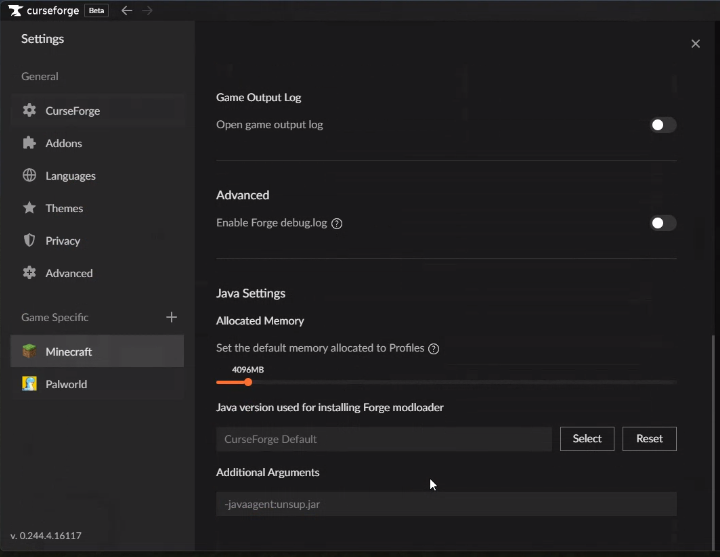
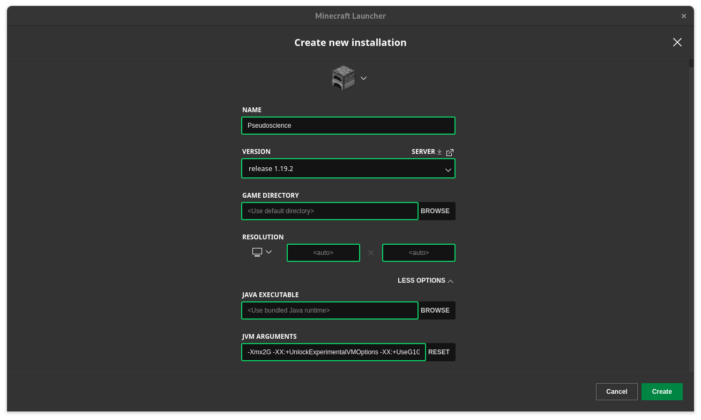

# pseudoscience-modpack

## Installation (3 Methods)
### #1 (Vanilla Launcher)
0. Download the latest Forge & the Minecraft launcher
1. Download and execute this script for Windows: [https://github.com/nyxmc/pseudoscience-modpack/raw/v1.1/include/Launcher/install.ps1](url) or Mac: [https://github.com/nyxmc/pseudoscience-modpack/raw/v1.1/include/Launcher/install.command](url)
#### #2 (Prism Launcher)
> [!NOTE]
> This doesn't work with MultiMC.
0. Download unsup 0.2.3 ([https://git.sleeping.town/unascribed/unsup/releases](url)) 
1. Open "Add Instance," navigate to Import & input the direct download: [https://github.com/nyxmc/pseudoscience-modpack/releases/download/v1.1.2/Pseudoscience.SMP.Modpack.Iteration.1.Prism.zip](url)
#### #3 (Curseforge)
1. Download the Curseforge .zip modpack.
2. Add `-javaagent:unsup.jar` to the JVM arguments
> [!WARNING]
> This breaks other packs, it is suggested to edit the instance in the Minecraft Launcher.
Refer to this image for details on setting the JVM arguments.

#### #4 (Non-Prism/Curseforge)
> [!NOTE]
> We do not actively support this, we suggest going with #1.
0. Download unsup 0.2.3 ([https://git.sleeping.town/unascribed/unsup/releases](url)),
1. Create an instance on your launcher & place this .jar into your .minecraft folder.
2. Place the [unsup.ini](include/unsup.ini) into the .minecraft folder.
3. Add `-javaagent:unsup-0.2.3.jar` to the JVM arguments, if your launcher supports them.
If adding JVM arguments to the vanilla launcher (& you decided not to perform #1, under JVM arguments, go to the very right with your arrow keys and enter `-javaagent:unsup-0.2.3.jar`,add a space between the last argument and this one.

